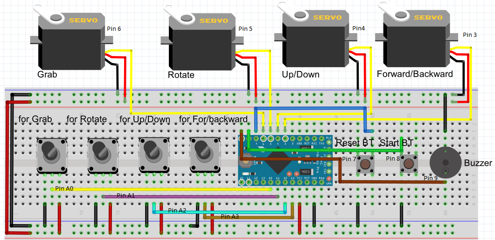

# What you will need - Hardware

For this project you will need:
- Arduino Pro Mini (5v version)
- 4 micro servos FS90MG 
- 4 potentiometers (e.g. 5KOhm)
- 2 push buttons
- 1 on/off switch buzzer
- 1 DC power jack
- Power adapter 5V - 2A

The connections are pretty easy, see the above image with the breadboard circuit schematic.

Servo Motors:
- Servo for Grab movement  to Arduino pin 6
- Servo for Rotate movement to Arduino pin 5
- Servo for Up/Down movement to Arduino pin 4
- Servo for Forward/Backward movement to Arduino pin 3
- All black cables to GND
- All red cables to Vcc - 5V

Potentiometers:
- for Grab movement  to Arduino pin A0
- for Rotate movement to Arduino pin A1
- for Up/Down movement to Arduino pin A2
- for Forward/Backward movement to Arduino pin A3
- All left pins to GND
- All right pins to Vcc - 5V

Buttons:
- Teach button to Arduino pin 7
- Start button to Arduino pin 8

Buzzer:
- buzzer to arduino pin 9
